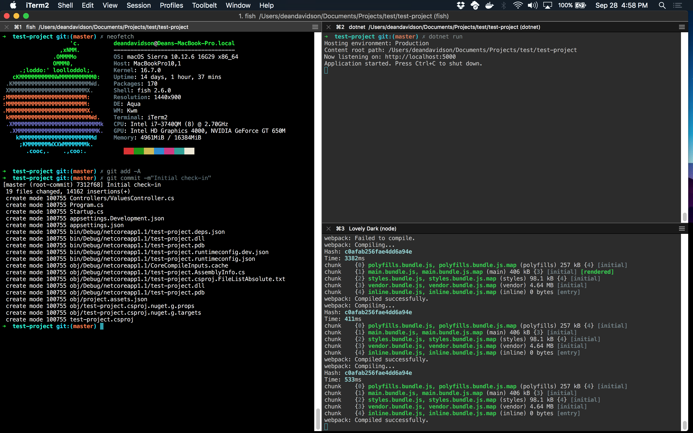

# iterm2-lovely-dark
My personal iTerm 2 color scheme. Nothing special but I think it looks nice! If properly set up, it should look something like this:

With Angular / Core Web API Projects I like to arrange my terminal windows as above. I can monitor my web API output and NPM window and I use the window with more vertical real-estate as my working window to run git commands, etc.
